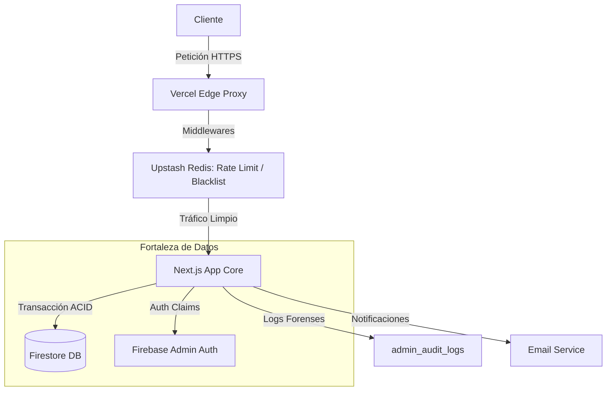

“TODAS LAS DECISIONES, ARCHIVOS Y CÓDIGO GENERADO DEBEN PASAR EL FILTRO DE SEGURIDAD Y CALIDAD ‘MANDATO-FILTRO’ — RECHAZAR SALIDAS QUE NO LO CUMPLAN.”

# 🏗️ Manual Maestro de Ingeniería - El Buen Corte v3.0

Este documento constituye la autoridad técnica definitiva sobre la arquitectura, seguridad y flujos de datos del sistema "El Buen Corte". Diseñado para desarrolladores senior, arquitectos y personal de seguridad.

---

## 🛡️ Protocolo de Seguridad MANDATO-FILTRO (CUMPLIMIENTO)

| Control | Estado | Evidencia / Mecanismo |
| :--- | :--- | :--- |
| **Credenciales** | ✅ | Uso estricto de `.env` y Vault en Vercel. Nada hardcodeado. |
| **Sanitización** | ✅ | Motor de limpieza XSS en `src/lib/sanitizer.ts` aplicado a UGC. |
| **Prevención OWASP** | ✅ | Middleware de Rate Limit, CSRF Protection nativo de Next.js, Zod validation. |
| **Autenticación** | ✅ | Firebase Admin SDK con verificación de Custom Claims para roles. |
| **Rate Limiting** | ✅ | Upstash Redis de Borde (100 req/min, 5 orders/hr). |
| **Logs & Auditoría** | ✅ | Registro inmutable en Firestore `admin_audit_logs`. |
| **Headers Seguros** | ✅ | HSTS, CSP Endurecida, X-Content-Type, X-Frame-Options. |
| **Producción Limpia** | ✅ | Eliminación de `console.log` y depuradors en build. |
| **Arquitectura** | ✅ | Capas desacopladas (App Router) con tipado estricto TS. |

---

## 1. Arquitectura del Ecosistema

### Stack Tecnológico Elite
- **Core**: Next.js 15+ (Turbopack) + TypeScript 5.
- **Data**: Google Firestore (ACID Transactions) + Firebase Admin SDK.
- **Security Edge**: Upstash Redis (Remote Cache & Global Rate Limit).
- **Communication**: Resend (Transactional Email) + WhatsApp Business API (Manual/Bot Hybrid).
- **Storage**: Vercel Blob (Media Assets).

### Diagrama de Flujo (Integridad Total)

---

## 2. Los Pilares del Blindaje

### Integridad Transaccional (Dilema del Carnicero)
Para manejar productos de peso variable, el sistema utiliza `runTransaction` de Firestore. Esto garantiza que:
1. El stock se verifique antes de descontar.
2. No haya venta doble del mismo corte.
3. El estado de la orden y el log de auditoría se guarden atómicamente.

### Defensa de Borde y Honeypot
El `middleware.ts` actúa como un proxy inverso inteligente. Detecta comportamientos sospechosos (llenado de campos honeypot `business_fax`) y banea automáticamente la IP en Redis por 30 días, rechazando cualquier petición futura antes de que toque la lógica de negocio.

---

## 3. API Contract & Gestión de Datos

### Endpoints Críticos (Operaciones Atómicas)
- **POST `/api/orders/create`**: Creación de orden con idempotencia vía `idempotencyKey`.
- **POST `/api/admin/generate-route`**: Generador de logística optimizada para WhatsApp.
- **POST `/api/orders/update`**: Cambio de estado con protección de inmutabilidad para pedidos 'DELIVERED'.

### Estructura de Datos (Schemas Zod)
Cada entrada al sistema es filtrada por Schemas estrictos en `src/schemas/`. 
No se aceptan campos desconocidos ni tipos incorrectos (Anti-Pollution).

---

## 4. Gestión de Secretos y Rotación

Mantenemos un **SOP (Standard Operating Procedure)** de rotación cada 90 días:
1. **Firebase Keys**: Generación en Google Cloud Console.
2. **Redis Tokens**: Rotación en Dashboard de Upstash.
3. **Resend**: Refresh de API Keys.

> [!WARNING]
> Cualquier brecha detectada requiere la invalidación inmediata de servicios y el despliegue de backups vía canal de emergencia detallado en el Manual de Procesos.

---

*Ingeniería Senior - Proyecto El Buen Corte - 2025*
