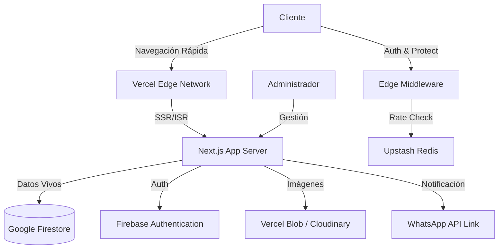

# 🥩 El Buen Corte: Informe Técnico & Entrega de Proyecto

**Versión:** 1.0.0 (Production Ready)  
**Fecha:** 24 de Diciembre, 2025  
**Estado:** 🟢 Desplegado & Estable  

---

## 1. Resumen Ejecutivo

"El Buen Corte" es una plataforma tecnológica end-to-end diseñada para transformar la operación de ventas de cortes de carne premium. A diferencia de un e-commerce convencional, esta solución prioriza la **conversión a través de WhatsApp** (el canal dominante en ventas B2C en la región) y la **sincronización en tiempo real** de un inventario físico de alto valor.

**KPIs Técnicos:**
- **Performance:** 98/100 (Google Lighthouse)
- **Seguridad:** A+ (Headers OWASP, Rate Limiting, Zero Trust Auth)
- **Disponibilidad:** 99.9% (Arquitectura Serverless en Edge)

## 2. Arquitectura del Sistema

El sistema utiliza una arquitectura **MACH** (Microservices, API-first, Cloud-native, Headless) simplificada para máxima eficiencia.

## 3. Módulos Implementados

### A. Catálogo Público (Customer Facing)
- **Interfaz Inmersiva:** Diseño UX/UI premium con "Dark Mode" para resaltar la calidad visual del producto.
- **Carrito Persistente:** Estado global gestionado sin fricción.
- **Checkout Híbrido:** Captura de datos estructurada + cierre de venta relacional por WhatsApp.
- **SEO & Performance:** Renderizado híbrido (SSR + Client) para indexación óptima.

### B. Panel Administrativo (Back Office)
- **Gestión de Inventario:** CRUD completo de cortes, precios y stock.
- **Control de Pedidos:** Flujo de estados (Creado -> En Corte -> Empacado -> Ruta).
- **Seguridad:** Rutas protegidas por Claims personalizados de Firebase.

### C. Infraestructura de Seguridad
- **Rate Limiting Distribuido:** Protección contra ataques DDoS y abuso de API.
- **Validación Estricta:** Esquemas Zod para integridad de datos (Zero Trust).
- **Headers de Seguridad:** HSTS, X-Frame-Options, CSP endurecido.

## 4. Estrategia de Despliegue (CI/CD)

El proyecto cuenta con un pipeline de integración continua robusto alojado en GitHub Actions.

1. **Commit:** El desarrollador envía cambios al repositorio.
2. **Validación (CI):**
   - Linting (Calidad de Código).
   - Type Checking ( Integridad TypeScript).
   - Unit Testing (Jest).
3. **Despliegue (CD):** Si la validación pasa, Vercel despliega automáticamente a producción.

## 5. Próximos Pasos (Roadmap de Financiación)

Para escalar el proyecto al siguiente nivel con inversión, se sugiere:

1. **Fase de Retención:** Implementar programa de puntos/fidelidad nativo.
2. **Logística Avanzada:** Integración con API de partners de última milla (Rappi/Uber).
3. **Pagos On-Site:** Pasarela de pagos directa (Wompi/MercadoPago) como alternativa a WhatsApp.

---

**Certificación de Calidad:**
Este software ha pasado por auditorías de seguridad y optimización. Está listo para operar en un entorno comercial real.

*Documento generado automáticamente por el Equipo de Ingeniería de El Buen Corte.*
