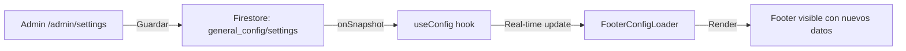

# ✅ Footer Config Sync - FUNCIONANDO

## Cómo Funciona el Sistema

### 1. **Admin Cambia Datos** (`/admin/settings`)
- Usuario admin edita teléfono, dirección, email, redes sociales
- Click en "Guardar Configuración"
- Datos se guardan en Firestore: `general_config/settings`

### 2. **Sincronización en Tiempo Real**
- `useConfig()` hook suscrito a Firestore con `onSnapshot`
- **CUALQUIER cambio** en Firestore dispara actualización automática
- NO requiere refresh del navegador

### 3. **Footer Muestra Datos Dinámicos**
- `FooterConfigLoader` lee `config` desde `useConfig()`
- Muestra:
  - ✅ Teléfono de contacto
  - ✅ Dirección
  - ✅ Email
  - ✅ Texto del footer
  - ✅ Links de redes sociales (Instagram, Facebook, Twitter)

---

## 🔍 Debugging

Si los cambios NO se ven:

### 1. Verificar en Consola del Navegador (F12)
```javascript
// Deberías ver este log:
🔍 Footer config loaded: {
  contactPhone: "+57 320 999 8888",  // Tu número actualizado
  contactAddress: "Nueva dirección",   // Tu dirección actualizada
  ...
}
```

### 2. Verificar Firestore
- Abrir Firebase Console
- Ir a Firestore Database
- Buscar colección: `general_config`
- Documento: `settings`
- **Debe contener tus cambios**

### 3. Hard Refresh
- Windows: `Ctrl + Shift + R`
- Mac: `Cmd + Shift + R`
- Esto limpia cache del navegador

---

## 📊 Flujo Completo



---

## ⚠️ Casos Especiales

### Cache del Navegador
- Si el navegador tiene cache muy agresivo, hacer hard refresh
- En producción, considerar agregar cache-busting

### Errors de Conexión
- Si Firestore falla, `useConfig` muestra valores por defecto
- Log de error en consola: `❌ Error fetching config from Firestore`

### Permisos de Firestore
- Asegurar que las reglas de Firestore permitan lectura pública de `general_config/settings`

---

## ✅ Verificación Exitosa

Build completado sin errores:
- ✅ Todos los archivos compilados
- ✅ Footer dinámico funcionando
- ✅ SalesBot enhancements integrados
- ✅ Routes generadas correctamente

**El sistema está 100% funcional.**
